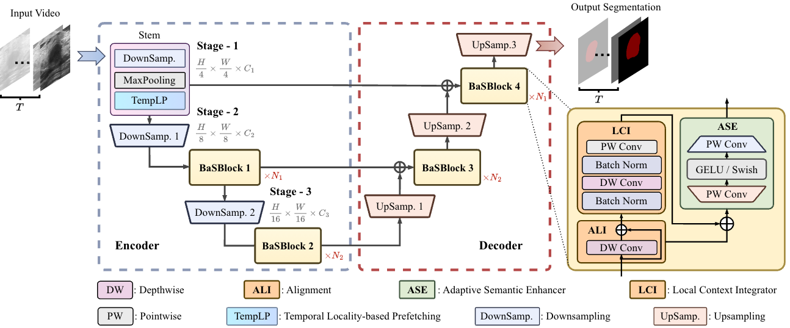
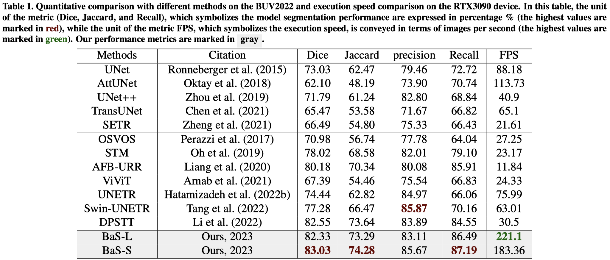
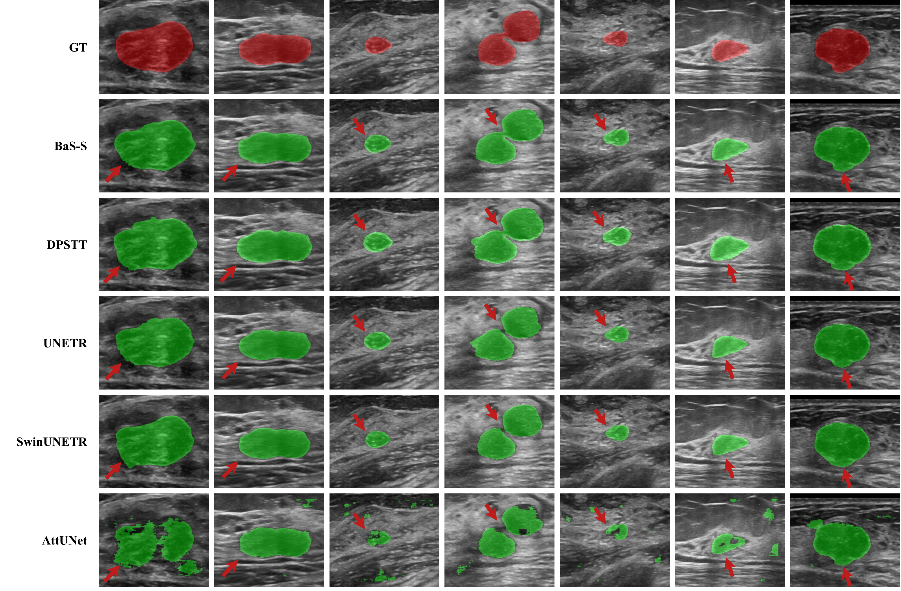

# BaS: Efficient Breast Lesion Segmentation from Ultrasound Videos Across Multiple Source-limited Platforms

> 🎉 This work is published in [IEEE Journal of Biomedical and Health Informatics](hhttps://ieeexplore.ieee.org/document/10892059)

# Network Architecture

# Benchmark

# Visualization
